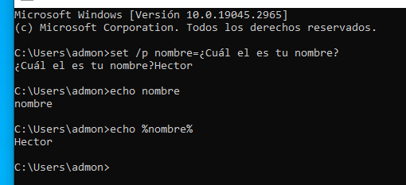

# Apuntes - Héctor Moreno

## Comandos Windows

### Eliminar una carpeta

`rmdir` -> Para eliminar una carpeta

`rmdir /s` -> para eliminar carpeta con contenido dentro

### Cambiar nombre a un archivo

`ren "archvio.txt" "nuevonombre.txt"`

### Listar todos los procesos activos

`tasklist`

### Para eliminar procesos

`taskkill`

`taskkill /f` -> para que no te pregunte si estás seguro de eliminar el proceso.

### Listar todos los servicios encendidos

`sc query`

### Ver contenido de un archivo

`type nombre_archivo.txt`

## Comandos de redes

### Mostrar la interfaz de red

`ipconfig`

`ipconfig /all` -> lo muestra todo más detallado.

### Comprobar la conectividad con otro equipo

`ping direccion_ip`

`ping nombre_de_dominio`

**Ejemplo**

`ping 192.168.1.20`

`ping www-jerez.es`

### Saber la dirección ip de un servidor de dominio

`nslookup nombre_de_dominio`

### Sitios por donde pasa la petición que se manda

`tracert www.jeres.es`

## Variables de entorno

`%USERNAME%` -> Usuario actual

`%COMPUTERNAME%` -> Nombre del equipo

`USERPROFILE` -> Carpeta personal

`%WINDIR%` -> Carpeta del sistema

`%PATH%` -> Ruta a los archivos ejecutables "importantes" a los que quiero acceder "rápidamente" desde la consola.

## Crear variables de entorno

### Para crear variables de entorno ponemos:

`set nombre=resultado`

**Ejemplo**


### Para eliminar la variable

`set nombre=`

### Listar todas las variables

`set`

**Ejemplo**


### Para añadir una ruta en el PATH

`set PATH=%PATH%;C:\Users\admon\Desktop\misprogramas`

Sólo en el CMD que esté ejecutandose. Si se cierra, se pierde lo que he añadido al PATH.

### Para que el cmd me pregunte

`set /p variable=texto_que_me_dice`



## Archivos bat (por lotes) o Script de Windows

Un archivo bat, es simplemente un archivo de texto con extensión bat que contiene una serie de comandos para que el cmd lo ejecute automáticamente uno detrás de otro.

## Condicionales con IF-ELSE

Un condicional permite ejecutar unas instrucciones cuando se cumple una condición.

### Ejemplo de condicional

```
@echo off

echo Quieres continuar? Contesta si o no

set /p respuesta=

if /i %respuesta%==si (
echo Has elegido continuar
) else (
echo Has elegido no continuar
)
pause
```

`/i` -> Esto hace que la comparación no distinga entre mayúscula y minúscula.

### Ejemplo condicional con números

**Comparación de si es igual:**

```
@echo off
echo Adivina el número:
set /p respuesta=

if %respuesta% EQU 4 (
echo Has acertado.
) else (
echo No has acertado.
)
pause
```

**Comparación de si un número es mayor que otro:**

```
@echo off
echo Dime tu edad:
set /p respuesta=

if %respuesta% GEQ 18 (
echo Eres mayor de edad
) else (
echo No eres mayor de edad
)
pause
```
**Comparación de si son iguales o son distintos (EQU)**

```
@echo off
echo Dime un numero:
set /p numeroA=

echo Ahora dime otro numero:
set /p numeroB=

if %numeroA% EQU %numeroB% (
echo El primer numero es igual del segundo.
) else (
echo El primero numero es distinto del segundo
)
pause
```
**Mayor o igual a (GEQ)**

```
@echo off
echo Dime un numero:
set /p numeroA=

echo Ahora dime otro numero:
set /p numeroB=

if %numeroA% GEQ %numeroB% (
echo El primer numero es mayor o igual del segundo.
) else (
echo El primero numero es menor que el segundo
)
pause
```
**Menor a (LSS)**

```
@echo off
echo Dime un numero:
set /p numeroA=

echo Ahora dime otro numero:
set /p numeroB=

if %numeroA% LSS %numeroB% (
echo El primer numero es menor que el segundo.
) else (
echo El primero numero no es menor que el segundo
)
pause
```

**Comprobación de existencia**

```
@echo off
if exist "Encuentrame\" (
echo La carpeta Encuentrame ya existe
) else (
mkdir "Encuentrame"
echo La carpeta Encuentrame no existe
)
pause
```

### Operadores


| Operadores (para las comparaciones) | Significado|
| ------------ | ------------ | 
| == | Igual (solo para texto porque se compara un número lo interpreta como un carácter, es decir, como un símbolo)|
| not%respuesta%==paco | Distinto |
| EQU | Igual a ("equal") |
| NEQ | Distinto a ("not equal") |
| LSS | Menor a ("less") |
| LEQ | Menor o igual ("less equal") |
| GTR | Mayor a |
| GEQ | Mayor o igual | 
| exists | Existe |